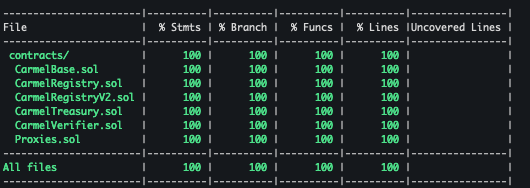
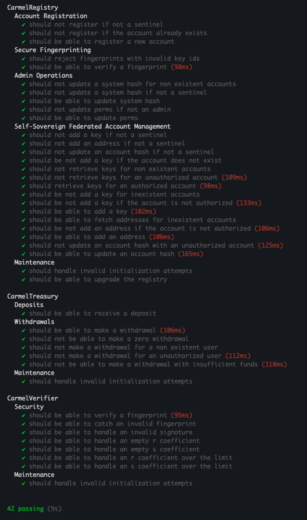

 

# Carmel City System

The **Carmel City System** is a group of Smart Contracts that represent the core functionality of the Carmel City Platform, on-chain. This includes the **Carmel Verifier**, the **Carmel Registry** and the **Carmel Treasury**. The system manages contracts, handles deposits and performs self-sovereign federated account operations, and much more.

## Smart Contracts

### The Verifier

The **Carmel Verifier** is in charge of verifying Secp256r1 WebAuthn signatures.

### The Registry

The **Carmel Registry** keeps track of all Carmel Accounts and associated data such as public keys

### The Treasury

The **Carmel Treasury** is responsible for managing funds for registered Carmel Accounts

## Code Quality

The code is covered 100% by tests, including all execution logic branches.

The code passes dozens of extensive test cases.

## Contributing

We welcome contributions from everyone! You can help by fixing bugs, suggesting some improvements, or even adding new features. Your contributions help us make Carmel City better for everyone. 

To get started, have take a look at the [Contributing Guidelines](CONTRIBUTING.md) and read the instructions carefully.

## Maintenance

The Carmel City code is maintained by [@idancali](https://github.com/idancali) and sponsored by [Fluid Trends](https://fluidtrends.com).

## License

The Carmel City platform is licensed under the [MIT License](LICENSE).

Copyright (C) 2025 - I. Dan Calinescu                